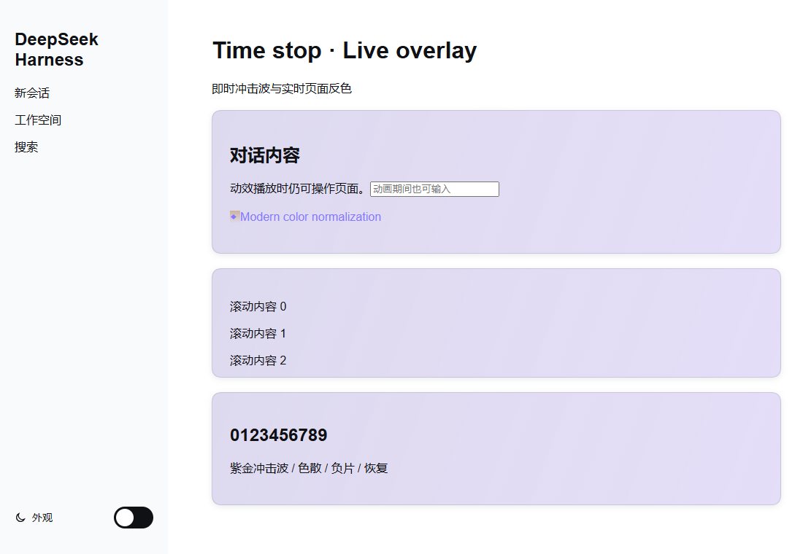
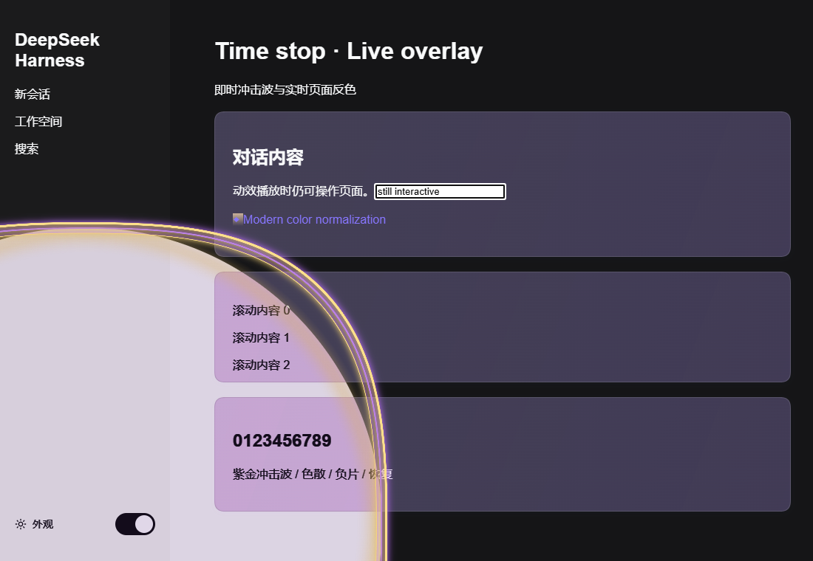
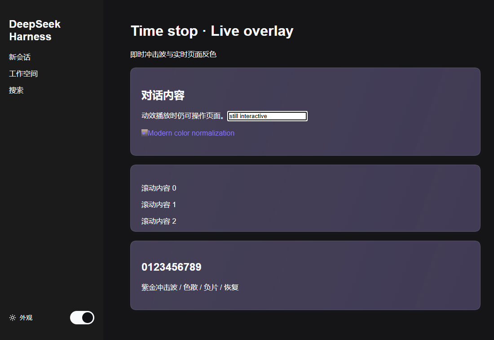

# DSH ZA WARUDO

[中文](#中文说明) · [English](#english)

为 DeepSeek Harness 侧栏增加「外观」Switch。点击后先完成开关滑动，再播放三秒的紫金时停波纹、反色转场与音效，随后切换浅色或暗色主题。





## 中文说明

### 功能

- 在侧栏「外观」行加入符合明暗主题的 Switch。
- 开关先流畅滑动，再启动全屏时停效果，避免两段动画争用绘制资源。
- 使用实时页面叠层，无需截图、克隆或遍历对话内容。
- 内置三秒音效；音频预加载失败时可在下次点击重试。
- 动效层不拦截页面输入。
- 系统启用「减少动态效果」时直接切换主题。

### 安装

```bash
dsh plugin --profile web add dsh-za-warudo
```

如果暂时未发布到 npm，也可以安装 GitHub 预构建版本：

```bash
dsh plugin --profile web add github:Fwkkk666/dsh-za-warudo
```

安装后刷新页面；桌面版如果没有自动生效，请重启 Harness。

### 卸载

```bash
dsh plugin --profile web remove dsh-za-warudo
```

### 兼容性

需要带有 `sidebar.footer.action` 插槽和主题服务的 DSH Web/DSH Desktop，声明兼容 DSH `0.1.0-rc.7` 及以上版本。其他插件若替换同一侧栏区域或主题服务，可能需要调整加载顺序。

## English

Adds an Appearance switch to the DeepSeek Harness sidebar. The switch finishes its slide first, then plays a three-second purple/gold time-stop wave with color inversion, sound, and a light/dark theme change.

### Features

- Theme-aware light/dark switch in the sidebar.
- Switch-first sequencing for immediate visual feedback.
- Live-page overlay with no screenshots or DOM cloning.
- Bundled three-second sound effect with retryable preloading.
- Non-blocking overlay: the page stays interactive.
- Honors `prefers-reduced-motion` by switching immediately.

### Install

```bash
dsh plugin --profile web add dsh-za-warudo
```

GitHub fallback:

```bash
dsh plugin --profile web add github:Fwkkk666/dsh-za-warudo
```

Refresh the page after installation. Restart Harness if a desktop host does not hot-load the plugin.

### Uninstall

```bash
dsh plugin --profile web remove dsh-za-warudo
```

## Development

```bash
npm install
npm run build
npm run check
npm pack --dry-run
```

The repository includes prebuilt `lib/client.js`, so GitHub installation does not require running a package build script.

## License

MIT
